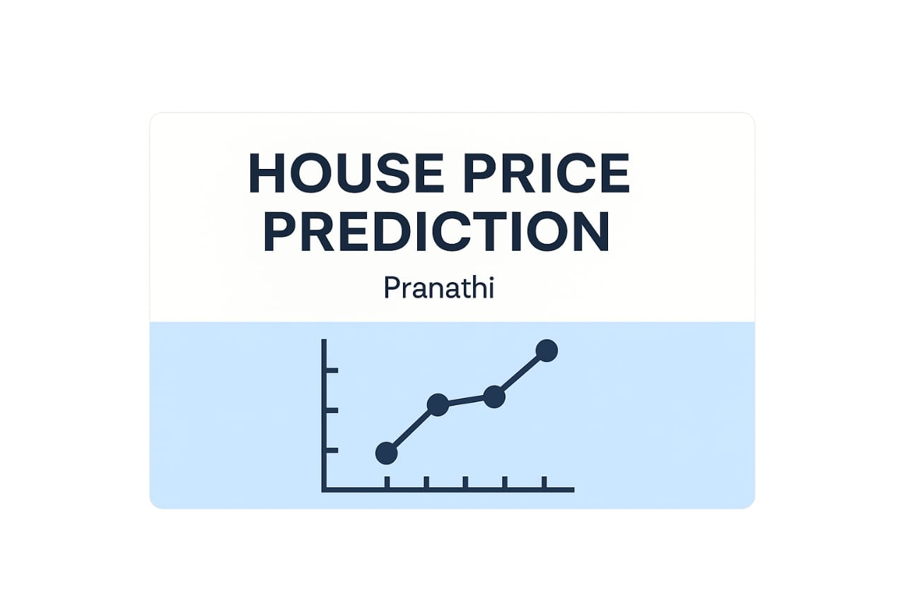

  

A simple Linear Regression Project to predict the House prices of that Area based on the Area Prices 
# House Price Prediction using Linear Regression
 
This is a beginner-friendly machine learning project where I use a simple Linear Regression model to predict house prices based on the area (in square feet).
 
## Tools Used
- Python
- Pandas
- NumPy
- Matplotlib
- scikit-learn
 
## What this Project Does
- Loads custom dataset
- Trains a linear regression model
- Visualizes data with a scatter plot
- Predicts prices for new inputs
- Plots the regression line
 
## Why This Project 
I'm learning the Fundamentals of Machine Learning and Gen AI and this is one of the small but Practical step sin building my portfolio

